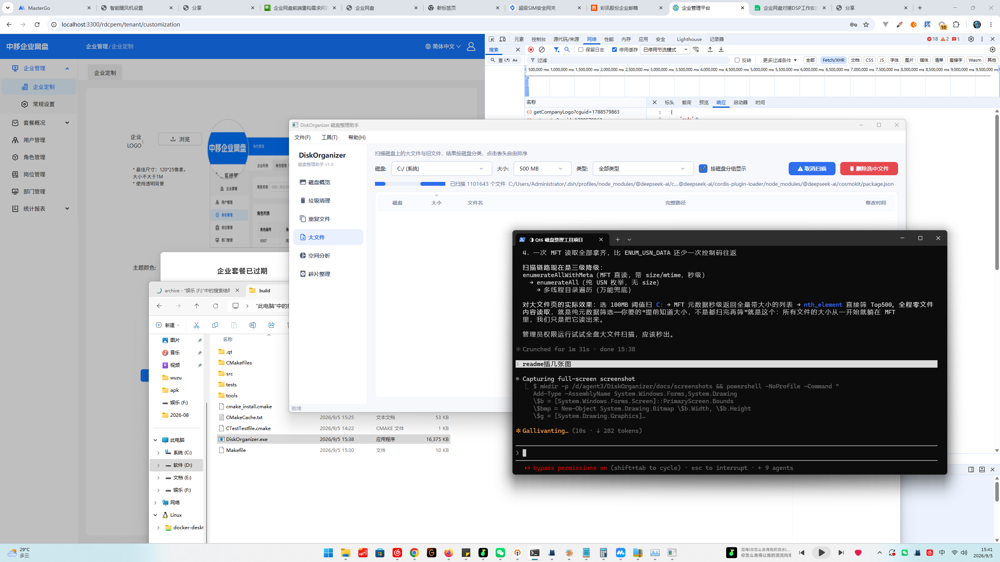
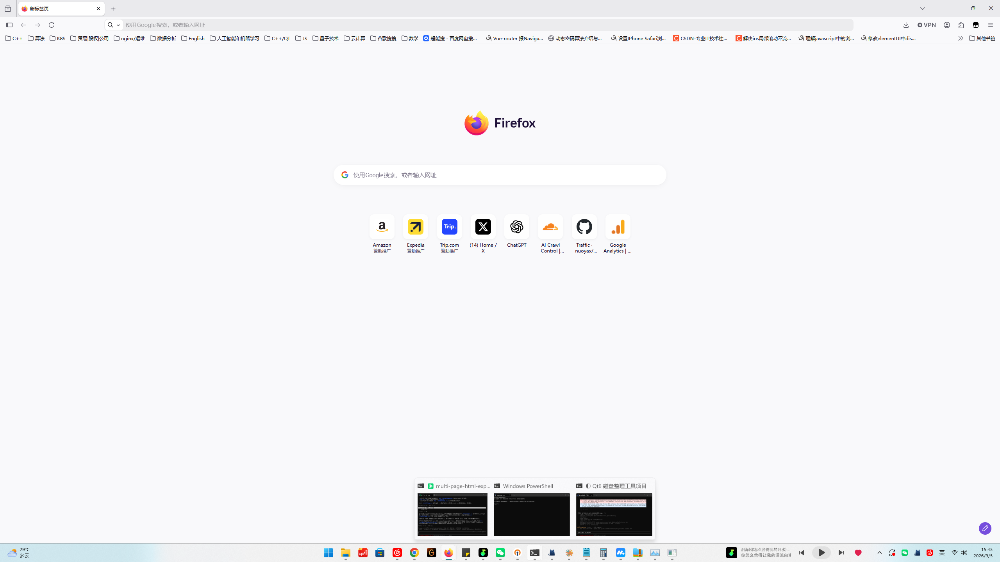
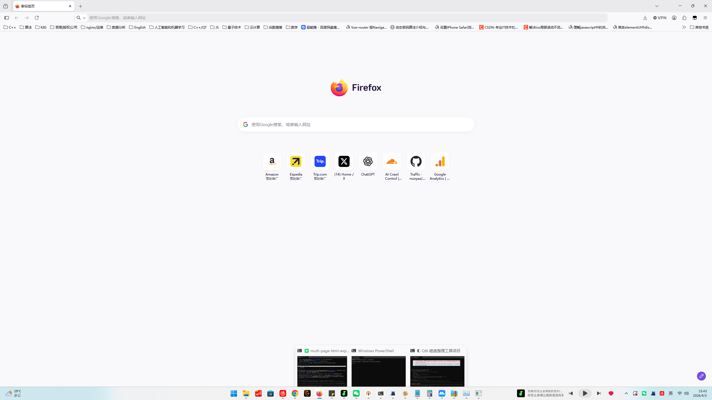
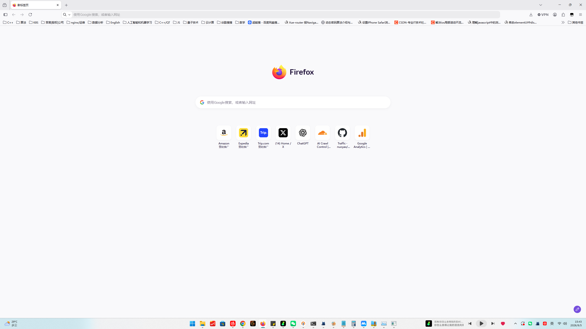

# DiskOrganizer 磁盘整理与清理工具

Qt6 / C++17 / MSVC /MT 全静态单文件，兼容 Windows 8+。



## 核心功能

| 模块 | 说明 |
|------|------|
| 概览 | 磁盘饼图 + 空间柱状图 + 磁盘信息表 |
| 垃圾清理 | 12 类常见垃圾（临时文件/缓存/回收站等），复选框勾选、实时占比图 |


| 重复文件 | 按大小预筛 + 哈希精确比对 |


| 大文件 | 按磁盘/大小阈值/扩展名组扫描，12 类型组可搜索下拉；小文件/小目录自动剪枝提速 |


| 空间分析 | 目录树占比、彩色矩形图 |
| 碎片整理 | 机械盘 defrag / SSD TRIM 优化 |





## 扫描加速架构（三层）

1. **USN Journal / MFT 快速路径**：NTFS 整卷扫描走 `FSCTL_ENUM_USN_DATA` 直接枚举 MFT 记录（Everything 同款路线），全盘 100 万文件约 1-3 秒；FRN→路径回溯带缓存。非 NTFS / 无权限时自动回退。
2. **多线程并行遍历**（回退路径）：一级子目录分片 + `QtConcurrent::blockingMapped`，每核一线程，原子进度计数，取消即时生效。
3. **大文件过滤加速**：分块并行过滤 + `std::nth_element` TopN（O(n) 选择）。

> 注：整卷扫描优先直读原始 $MFT 解析 `$FILE_NAME` 属性，**可同时拿到文件大小与修改时间**；失败时退到纯 USN 枚举（不含 size/mtime），最后才回退并行遍历。

## 构建

要求：CMake ≥ 3.21、MSVC、Qt 6.5 静态库（含 Core/Gui/Widgets/Concurrent/Svg）。

```bash
cmake -B build -G "NMake Makefiles" -DCMAKE_BUILD_TYPE=Release \
      -DCMAKE_PREFIX_PATH=<Qt静态库路径>
cmake --build build
```

产物：`build/DiskOrganizer.exe` —— **零 Qt / CRT DLL 依赖**（`/MT` 运行时 + 静态 Qt），拷到任何 Win8+ 机器直接运行。

## 使用注意

- USN 快速路径需要**管理员权限**（读卷句柄）；无权限时静默回退并行遍历。
- 删除/清理操作经回收站（可配置直接删除）。
